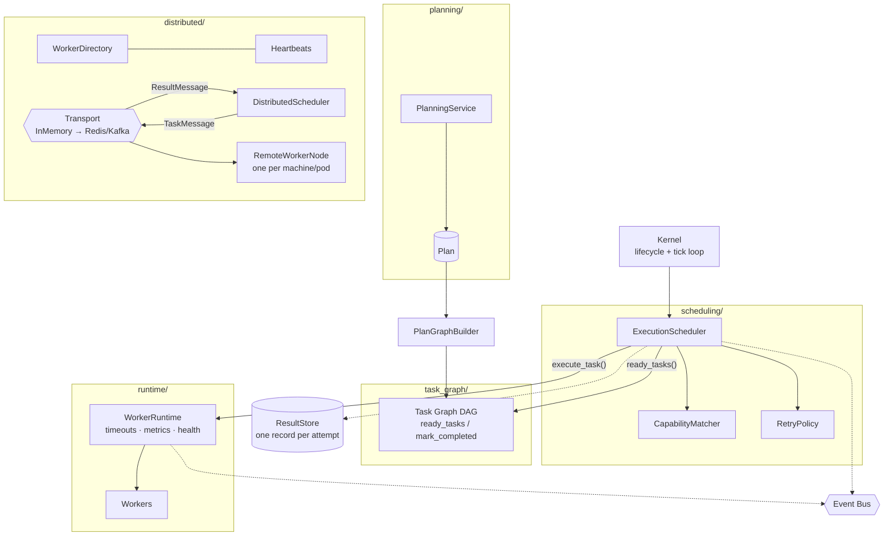

# AgentOS

**An operating system for AI agents.**

Python 3.11+ · MIT License · 347 tests passing

AgentOS takes a high-level goal, breaks it into tasks, figures out the right
order, matches each task to a capable AI worker, runs it safely with timeouts
and metrics, and coordinates all of it — even across multiple machines.

- ❌ It is **not** a chatbot.
- ❌ It is **not** a LangGraph demo.
- ✅ It **is** an execution platform for coordinating autonomous AI workers —
  think of the plumbing that would sit underneath an army of agents.

---

## How it works — the life of a goal

Think of a construction company building a house. The client states a goal, an
architect breaks it into steps, some steps depend on others, a foreman assigns
ready steps to the right crews, and a site office tracks who is working and who
is done. AgentOS is that company, for AI work:

```
You: "Build a REST API for a blog"
        │
   [Planner]          → turns the goal into ordered, capability-tagged tasks
        │
   [Task Graph]       → a DAG: which tasks block which (no cycles allowed)
        │
   [Scheduler]        → matches READY tasks to capable, free workers
        │
   [Worker Runtime]   → runs each task with timeouts, isolation, metrics
        │
   [Workers]          → the agents that research / code / test / document
        │
   [Reflection]       → judges each output; can inject corrective/follow-up
        │                tasks into the LIVE graph (bounded by a replan budget)
        │
   → results flow back, dependent tasks unlock, the goal expands itself
     as needed, until the work is genuinely done
```

The one rule that keeps it clean: **each layer only asks one question of the
next.** The Scheduler only ever asks the graph *"what's ready?"* — it never
reasons about dependencies. It only asks the runtime *"who's free?"* — it never
touches a worker object.

## Architecture



## Quick start

```bash
git clone https://github.com/Kishorevijay07/AgentOS.git
cd AgentOS
pip install -r requirements.txt

python main.py    # run the demo kernel end-to-end
pytest -q         # run the test suite (347 tests)
```

### Plan and execute a goal (single process)

```python
from planning import TemplatePlanner
from planning.models import Goal
from task_graph import PlanGraphBuilder
from runtime import DefaultWorkerRuntime
from scheduling import ExecutionScheduler
from agents.coding import CodingAgent
from agents.research import ResearchAgent
from agents.testing import TestingAgent
from agents.documentation import DocumentationAgent

# 1. Plan: goal -> ordered, capability-tagged tasks
plan = TemplatePlanner().plan(Goal(description="Build a REST API for a blog"))

# 2. Compile the plan into an executable dependency graph (DAG)
graph = PlanGraphBuilder().build(plan)

# 3. Stand up a worker pool
runtime = DefaultWorkerRuntime()
for agent in (ResearchAgent(), CodingAgent(), TestingAgent(), DocumentationAgent()):
    runtime.register_worker(agent)

# 4. Schedule: match ready tasks to capable workers until the graph drains
ExecutionScheduler(graph, runtime).run_until_idle()

print(f"Completed {len(graph.completed_tasks())} tasks")
runtime.shutdown()
```

### The same thing, distributed

Workers can live in other processes or on other machines. All coordination is
messages over a pluggable transport — the scheduler cannot tell (and does not
care) whether a worker is local or remote:

```python
from distributed import (
    InMemoryTransport, WorkerDirectory, RemoteWorkerNode, DistributedScheduler,
)
from agents.coding import CodingAgent

transport = InMemoryTransport()          # swap for Redis/Kafka later
transport.start()

directory = WorkerDirectory(transport)   # service discovery, fed by messages
directory.start()

# One of these runs per machine / container / pod:
node = RemoteWorkerNode(CodingAgent(), transport, worker_id="coder-1")
node.start()

scheduler = DistributedScheduler(graph, directory, transport)
scheduler.start()
scheduler.run_until_idle()
```

## Package map

| Package | What it is (plain English) |
|---|---|
| `kernel/` | The core loop. Boots, ticks, pauses, stops — coordinates everything, does nothing "smart" itself. |
| `planning/` | The architect. Turns a goal into an ordered plan (LLM-backed or template-based), validates it, converts it to tasks. |
| `task_graph/` | The dependency map. A thread-safe DAG that knows which tasks are ready, detects cycles, unlocks dependents on completion. |
| `scheduling/` | The foreman. Matches ready tasks to workers **by capability** (never by name) behind a pluggable dispatch backend (local ↔ transport), with retry policies. |
| `reflection/` | The critic. After a task runs, judges the output and — when it falls short — injects corrective/follow-up tasks into the live graph (the autonomous loop), bounded by a replan budget. |
| `checkpoint/` | The save-game. Snapshots the graph (with per-task history) + reflection budget to a pluggable store (atomic JSON file today); a crashed run resumes exactly where it left off. |
| `runtime/` | The site office. Manages the worker pool: lifecycle, timeouts, crash isolation, health checks, metrics. |
| `distributed/` | The radio system. Typed message protocol, pluggable transport, worker discovery, heartbeats, remote worker nodes. |
| `events/` | The announcement board. Publish/subscribe event bus — components react without knowing each other. |
| `result_store/` | The logbook. A full execution trace per **attempt** (retries never overwrite history). |
| `task_queue/` | Priority work queues behind swappable interfaces. |
| `agents/` | The workers themselves: coding, research, testing, documentation, planner, reflection. |
| `models/` | Shared data types (`Task`, `AgentResult`, enums). |
| `config/` | Validated runtime settings. |

## Design principles

- **Program to abstractions.** Every swappable subsystem sits behind an
  ABC/Protocol (`AbstractTaskQueue`, `Transport`, `LLMClient`, `Worker`, …).
  Moving from in-memory to Redis/Kafka is a construction-site change — business
  logic never changes. The in-memory transport even round-trips every message
  through the JSON codec, so anything that works locally is guaranteed
  wire-safe.
- **Explicit state machines.** Kernel, workers, and task nodes each have a
  guarded lifecycle — illegal transitions fail loudly instead of corrupting
  state.
- **Dependency injection, no globals.** Everything is wired at one composition
  root (`KernelContext`); tests inject fakes anywhere.
- **Events over calls.** Components publish `TASK_COMPLETED`, `AGENT_ONLINE`,
  etc.; observers subscribe. Nobody holds a reference to anybody.
- **One record per execution attempt.** A retried task keeps the history of
  every attempt, each with its own `execution_id`.

## What's real vs. what's stubbed (honest status)

**Real and tested (347 passing tests):** the entire coordination machine —
planning, DAG with cycle detection, capability scheduling, retries, timeouts,
failure isolation, metrics, health checks, event bus, execution traces, and the
distributed layer running full DAGs across simulated remote workers.

**Stubbed on purpose (the slots are carved, the brains come next):**

- Intelligence is opt-in: `OpenRouterLLMClient` (set `OPENROUTER_API_KEY` in
  `.env`, see `.env.example`, then run `python examples/llm_demo.py`) powers
  the planner and the coding/research workers; without a key, agents fall back
  to deterministic placeholders so everything still runs offline.
- `RedisTransport` ships and is fully covered by tests against a scripted fake
  Redis client, plus runnable multi-process scripts (`scripts/run_redis_worker.py`
  / `run_redis_coordinator.py`) — but it has not yet been exercised against a
  live Redis server in CI. Kafka remains designed-for, not written.
- Task timeouts are **cooperative** (Python threads can't be force-killed);
  hard isolation needs the planned process-based executor.
- `api/` and `memory/` are empty placeholders.
- `scheduler/` and `agents/registry.py` are a deprecated legacy layer
  (superseded by the unified scheduler + worker runtime, see ADR-0011) kept
  for compatibility pending a cleanup pass.

## Roadmap

| Version | Milestone |
|---|---|
| v0.4 ✅ | Planner, Task Graph, Worker Runtime, Execution Scheduler |
| v0.5 ✅ | Distributed runtime: transport, discovery, heartbeats, remote workers |
| v0.6 | **Real intelligence**: OpenRouter `LLMClient` wired into `LLMPlanner` + LLM-backed coding/research workers |
| v0.7 ✅ | One unified scheduler behind a `DispatchBackend` seam (local ↔ transport) + `RedisTransport` |
| v0.8 ✅ | **The autonomous loop**: reflection + dynamic replanning (inject corrective tasks into the live graph, bounded by a replan budget) |
| v0.9 ✅ | **Checkpointing & resume**: snapshot the graph (with per-task history) + reflection budget; survive a crash and resume without re-doing work |
| v1.0 | HTTP API, Kubernetes deployment, plugin workers |

## Documentation

- [`docs/ARCHITECTURE.md`](docs/ARCHITECTURE.md) — full architecture: module
  responsibilities, class diagrams, data flow, scalability plan.
- [`docs/adr/`](docs/adr/) — Architecture Decision Records (0001–0010)
  explaining *why* each major design choice was made.

## License

[MIT](LICENSE)
