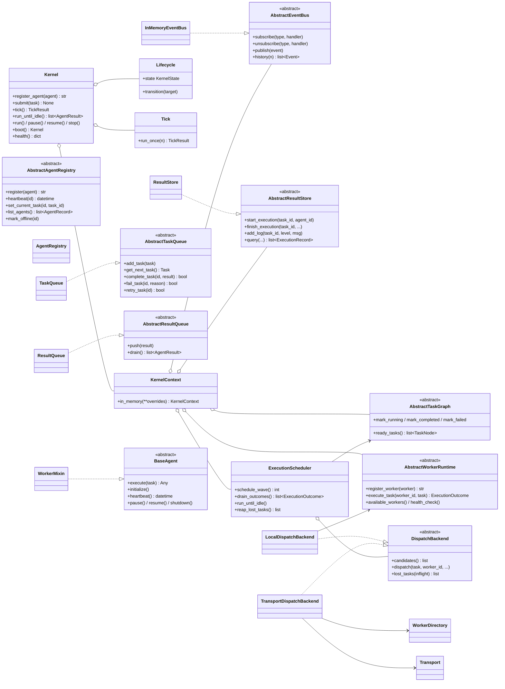
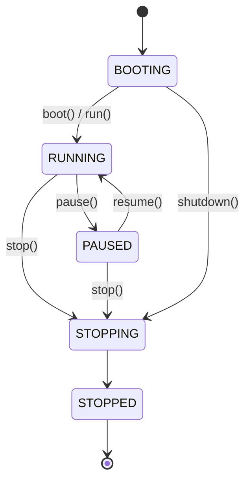
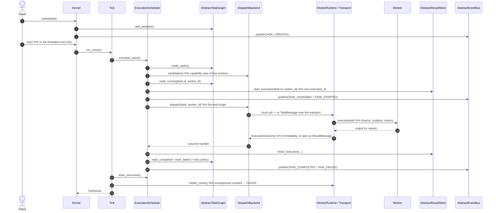

# AgentOS Architecture

AgentOS is an **agent runtime built like an operating-system kernel** — not a
chatbot. It schedules AI workers, manages task queues, dispatches work,
publishes events, and traces every execution. This document describes the
kernel design: the modules, how they fit together, and where the system is
headed (distributed workers, Redis/Kafka backends).

The guiding principle is **program to abstractions**: every subsystem that could
one day be swapped for a distributed backend sits behind an interface, and the
only place concrete implementations are chosen is the **Kernel** composition
root. Migrating the task queue to Redis is a one-line change in the Kernel and
nowhere else.

---

## 1. Module responsibilities

| Module | Responsibility (single) | Key types |
|---|---|---|
| `models/` | Plain data: the vocabulary every module shares. | `Task`, `AgentResult`, `Priority`, `Status`, `AgentStatus` |
| `events/` | Inter-component messaging (publish/subscribe). Nothing calls another component directly. | `AbstractEventBus`, `InMemoryEventBus`, `Event`, `EventType` |
| `task_queue/` | Hold pending work and completed results; priority + capability + dependency aware dispatch. | `AbstractTaskQueue`/`TaskQueue`, `AbstractResultQueue`/`ResultQueue` |
| `agents/` | Define what a worker *is* and its lifecycle; keep a live directory of them. | `BaseAgent`, `WorkerMixin`/`WorkerState`, `AbstractAgentRegistry`/`AgentRegistry`, concrete agents |
| `scheduler/` | Match a task's required capabilities to the best idle worker. Knows nothing about concrete agent classes. | `Scheduler` |
| `result_store/` | Canonical, queryable trace of every execution — one record per attempt (timing, logs, artifacts). | `AbstractResultStore`/`ResultStore`, `ExecutionRecord`, `LogEntry`, `Artifact` |
| `kernel/` | The runtime heartbeat + composition root: lifecycle, tick loop, DI. The one place implementations are chosen and injected. Drives the unified scheduler (ADR-0011). | `Kernel`, `KernelContext`, `Lifecycle`/`KernelState`, `Tick`/`TickResult`, `build_kernel` |
| `scheduling/` | **The** scheduler: one placement/reconciliation loop over a pluggable dispatch backend (local call ↔ transport message). | `ExecutionScheduler`, `DispatchBackend`, `LocalDispatchBackend`, `TransportDispatchBackend`, `CapabilityMatcher`, `RetryPolicy` |
| `runtime/` | Worker pool as a resource: lifecycle, timeouts, isolation, metrics, health. | `AbstractWorkerRuntime`/`DefaultWorkerRuntime`, `Worker`, `WorkerHandle`, `TaskExecutor` |
| `task_graph/` | Executable DAG: readiness, cycle detection, dependent unlocking. | `AbstractTaskGraph`/`InMemoryTaskGraph`, `TaskNode`, `PlanGraphBuilder`, `GraphTaskQueue` |
| `distributed/` | Messages-only coordination across machines: typed protocol, pluggable transport, discovery, heartbeats, remote nodes. | `Transport`/`InMemoryTransport`/`RedisTransport`, `WorkerDirectory`, `RemoteWorkerNode`, `DistributedScheduler` |
| `config/` | Tunable settings, validated. | `KernelSettings` |

Each module has exactly one reason to change. The Scheduler changes only when
matching policy changes; the Registry only when worker bookkeeping changes; the
Event Bus only when messaging semantics change.

---

## 2. Folder structure

```
agentos/
├── kernel/                  # Runtime heartbeat + composition root
│   ├── kernel.py            #   Kernel — lifecycle owner, tick loop, threaded run(), facade
│   ├── context.py           #   KernelContext — graph + worker runtime + scheduler (DI container)
│   ├── lifecycle.py         #   KernelState + Lifecycle transition guard
│   └── tick.py              #   Tick / TickResult (scheduler wave, collect, health)
├── scheduling/              # THE scheduler (one loop, pluggable backends — ADR-0011)
│   ├── scheduler.py         #   ExecutionScheduler — placement + reconciliation
│   ├── backend.py           #   DispatchBackend + Local/Transport implementations
│   ├── capability.py        #   CapabilityMatcher (+ HasCapabilities protocol)
│   └── retry.py             #   RetryPolicy strategies
├── config/
│   └── settings.py          # KernelSettings (pydantic)
├── models/                  # Shared data types (no behaviour)
│   ├── task.py              #   Task
│   ├── result.py            #   AgentResult
│   └── enums.py             #   Priority / Status / AgentStatus
├── events/                  # Pub/Sub messaging layer
│   ├── bus.py               #   AbstractEventBus + InMemoryEventBus
│   ├── event.py             #   Event envelope
│   └── event_type.py        #   EventType enum
├── task_queue/              # Work + result queues (interface-backed)
│   ├── task_queue.py        #   AbstractTaskQueue + TaskQueue
│   └── result_queue.py      #   AbstractResultQueue + ResultQueue
├── agents/                  # Workers
│   ├── base.py              #   BaseAgent (ABC — execution + lifecycle contract)
│   ├── worker.py            #   WorkerMixin + WorkerState state machine
│   ├── registry.py          #   AbstractAgentRegistry + AgentRegistry + AgentRecord
│   └── coding.py, research.py, testing.py, documentation.py, planner.py, reflection.py
├── scheduler/
│   └── scheduler.py         #   Scheduler (capability matching, dispatch/release)
├── result_store/            # Execution traces (one record per attempt)
│   ├── store.py             #   AbstractResultStore + ResultStore
│   ├── models.py            #   ExecutionRecord / LogEntry / Artifact
│   └── log_level.py
├── api/                     # (planned) HTTP adapter — see §7
├── main.py                  # Runnable reference composition
└── tests/                   # unit/ + integration/
```

---

## 3. Class diagram

Dependency edges point at **abstractions** — the scheduler and Kernel never
reference a concrete graph/runtime/store/bus. The Kernel holds a
`KernelContext` (the DI container) and drives `Tick`s through the `Lifecycle`;
each tick is one `ExecutionScheduler` wave over a pluggable `DispatchBackend`
(ADR-0011).



The Kernel's lifecycle:



---

## 4. Data flow — the execute-task loop



**Error path.** The worker runtime wraps `execute` in try/except with a
timeout: a crash or timeout becomes a failed `ExecutionOutcome`, never a crashed
loop. The scheduler reconciles it — `ERROR` log, `finish_execution(success=False)`,
`graph.mark_failed` — and the `RetryPolicy` decides whether to re-ready the task
(`retry_count` increments per attempt, each with its own `execution_id`). A
worker lost mid-flight (distributed) is detected via `lost_tasks()` and its task
failed/retried the same way.

---

## 5. Why each module exists

- **`models/` exists** so every other module speaks the same vocabulary without
  depending on each other. `Task`/`AgentResult` have no behaviour → zero coupling.
- **`events/` exists** to eliminate direct component-to-component calls. Publishers
  emit an `Event` and walk away; subscribers react. This is what lets a
  monitoring dashboard, a logger, and a metrics sink all observe the runtime
  without the Scheduler knowing they exist.
- **`task_graph/` exists** to be the single authority on *readiness*: the
  scheduler only ever asks "what's ready?", and dependency reasoning (cycles,
  unlocking) never leaks out of the graph.
- **`runtime/` exists** to manage workers as a resource — lifecycle, timeouts,
  crash isolation, metrics — so no other component ever touches a worker object.
- **`scheduling/` exists** to hold placement *policy* in one place: capability
  matching, retries, and reconciliation, over a `DispatchBackend` that decides
  only *how* work travels (local call ↔ transport message). One loop serves the
  single-process kernel and the distributed cluster (ADR-0011).
- **`agents/` exists** to define the worker contract (`BaseAgent`) and lifecycle
  (`WorkerMixin`) once; any object with that shape is schedulable.
- **`task_queue/` exists** as the queue-shaped seeding surface (the
  `GraphTaskQueue` adapter lets queue-speaking callers, like the
  PlanningService, feed the graph).
- **`result_store/` exists** to answer "what happened when task X ran?" with a
  full, queryable record — one per attempt (`execution_id`) — distinct from
  `task.result`, which is just a summary.
- **`kernel/` exists** to be the runtime + composition root. Concentrating all wiring in
  one place is what makes "replace a module without affecting the rest" true in
  practice rather than just in principle.

---

## 6. Design patterns used

| Pattern | Where | Why |
|---|---|---|
| **Composition Root + Facade** | `Kernel` / `KernelContext` | One place chooses/injects concretes; a small stable surface hides the graph. |
| **Dependency Injection (container)** | `KernelContext`, `ExecutionScheduler` | Collaborators passed in as abstractions via one context → testable, swappable. |
| **State Machine (runtime)** | `KernelState` + `Lifecycle` | Guards the BOOTING→…→STOPPED runtime lifecycle. |
| **Discrete tick loop** | `Tick` / `TickResult` | Replaces `while True` with inspectable, single-steppable iterations. |
| **Strategy ×3** | `DispatchBackend`, `CapabilityMatcher`, `RetryPolicy` | How work travels, where it lands, and how failure is handled are each swappable independently. |
| **Publish/Subscribe (Observer)** | `events/`, `distributed/transport` | Loose coupling between producers and reactors, in-process and across machines. |
| **Registry** | `WorkerDirectory` (+ legacy `AgentRegistry`) | Central lookup of live workers by id/capability/presence. |
| **Template Method / Mixin** | `WorkerMixin` + `BaseAgent` | Default lifecycle behaviour, overridable per concrete agent. |
| **State Machine** | `WorkerState` + `_TRANSITIONS` | Guards illegal worker lifecycle transitions. |
| **Data Transfer Object** | `Event`, `AgentResult`, `ExecutionRecord` | Immutable envelopes crossing module boundaries. |
| **Interface Segregation** | the four new ABCs | Each declares only what consumers depend on, not the concrete's full surface. |

---

## 7. Future scalability

The abstractions are the migration seams. Each maps to a distributed backend
with **no consumer change** — only the Kernel construction site changes.

| Abstraction | In-memory today | Distributed tomorrow |
|---|---|---|
| `Transport` | `InMemoryTransport` | **`RedisTransport` (shipped, v0.7)** · Kafka/NATS next — durable, partitioned messaging |
| `DispatchBackend` | `LocalDispatchBackend` | `TransportDispatchBackend` (shipped) · a container/K8s-job backend later |
| `AbstractTaskGraph` | dict + `RLock` DAG | Redis/SQL-backed graph for shared, durable, checkpointable state |
| `AbstractWorkerRuntime` | thread-pool execution | process-pool (hard kill) / remote-fleet runtime over RPC |
| `AbstractEventBus` | in-process synchronous | Redis Pub/Sub or Kafka for fan-out across nodes and durable event streams |
| `AbstractResultStore` | dict keyed by `execution_id` | SQL / Redis for durable, queryable, shared traces (one row per attempt) |

**Remote / plugin workers.** Any object with the `Worker` shape is schedulable.
A remote worker is a `RemoteWorkerNode` (one per process/container/pod) that
registers over the transport and heartbeats; the coordinator's
`WorkerDirectory` holds records, never objects, so remote and local workers are
indistinguishable to the scheduler.

**Runtime control.** The `Kernel` already runs a lifecycle (BOOTING→…→STOPPED)
and a discrete `tick()` that a threaded `run()` drives. A distributed deployment
becomes multiple Kernel/worker nodes sharing Redis/Kafka-backed queues, a bus,
and a registry — the tick loop and lifecycle are unchanged.

**Checkpointing.** Each attempt is an `ExecutionRecord` (own `execution_id`)
capturing start/end/logs/artifacts. A durable `AbstractResultStore` plus periodic
snapshots of queue state enables resuming in-flight work after a crash.

**Event sourcing.** Every state change already flows through the Event Bus. A
durable append-only event log (Kafka) makes the event stream the source of
truth: registry and queue state become projections that can be rebuilt by replay.

### Known gaps / next steps

- **`api/` is an empty placeholder** for a future HTTP adapter (submit tasks,
  query traces, stream events) that would depend only on the `Kernel` facade.
- **Legacy layer pending removal:** `scheduler/scheduler.py` and
  `agents/registry.py` are superseded by the unified scheduler + worker runtime
  (ADR-0011) but kept for `WorkerMixin` integration and old tests.
- **At-most-once delivery:** `InMemoryTransport` and Redis Pub/Sub both drop
  messages published while a subscriber is down. Durable, at-least-once
  delivery (with idempotent result handling keyed on `execution_id`) needs
  Redis Streams or Kafka behind the same `Transport` ABC.
- **Timeouts are cooperative** (thread-based); a process-pool `TaskExecutor`
  gives hard kills.
- **`memory/` is empty** — agent memory/MCP integration is a future sprint.

> **Resolved so far:** task lifecycle events published end-to-end (Sprint 3);
> real LLM planning + LLM-backed workers via OpenRouter (v0.6); the
> `Supervisor` → `Dispatcher` → **unified `ExecutionScheduler` with dispatch
> backends** consolidation, Kernel on the graph runtime, and the Redis broker
> swap (v0.7, [ADR-0011](adr/0011-unified-scheduler-dispatch-backends.md)).

---

See [`docs/adr/`](adr/) for the decision records behind these choices.
