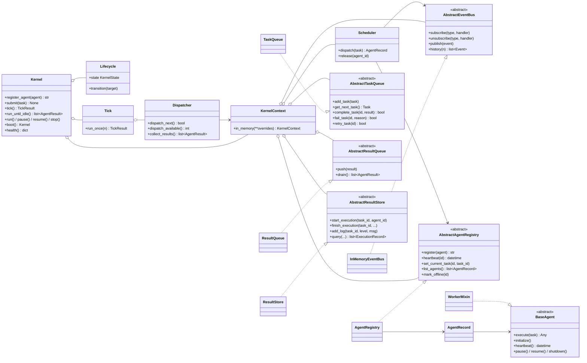
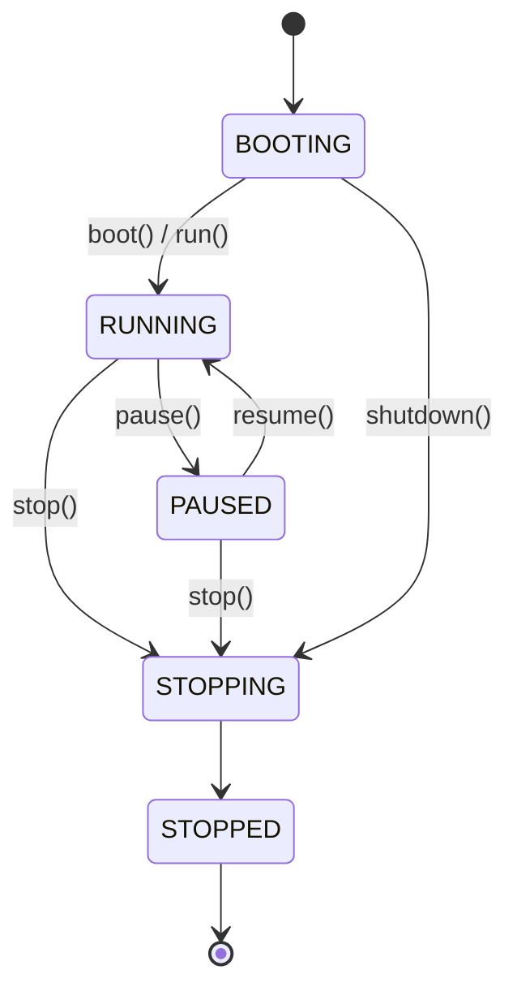
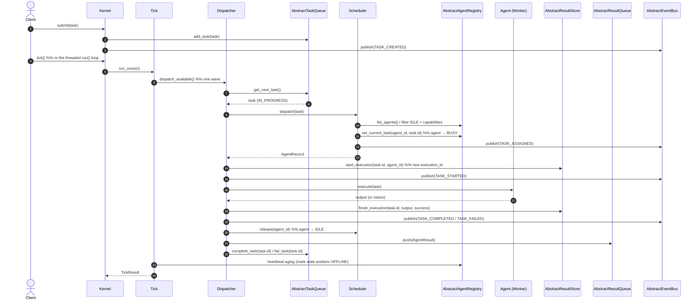

# AgentOS Architecture

AgentOS is an **agent runtime built like an operating-system kernel** — not a
chatbot. It schedules AI workers, manages task queues, dispatches work,
publishes events, and traces every execution. This document describes the
kernel design: the modules, how they fit together, and where the system is
headed (distributed workers, Redis/Kafka backends).

The guiding principle is **program to abstractions**: every subsystem that could
one day be swapped for a distributed backend sits behind an interface, and the
only place concrete implementations are chosen is the **Kernel** composition
root. Migrating the task queue to Redis is a one-line change in the Kernel and
nowhere else.

---

## 1. Module responsibilities

| Module | Responsibility (single) | Key types |
|---|---|---|
| `models/` | Plain data: the vocabulary every module shares. | `Task`, `AgentResult`, `Priority`, `Status`, `AgentStatus` |
| `events/` | Inter-component messaging (publish/subscribe). Nothing calls another component directly. | `AbstractEventBus`, `InMemoryEventBus`, `Event`, `EventType` |
| `task_queue/` | Hold pending work and completed results; priority + capability + dependency aware dispatch. | `AbstractTaskQueue`/`TaskQueue`, `AbstractResultQueue`/`ResultQueue` |
| `agents/` | Define what a worker *is* and its lifecycle; keep a live directory of them. | `BaseAgent`, `WorkerMixin`/`WorkerState`, `AbstractAgentRegistry`/`AgentRegistry`, concrete agents |
| `scheduler/` | Match a task's required capabilities to the best idle worker. Knows nothing about concrete agent classes. | `Scheduler` |
| `result_store/` | Canonical, queryable trace of every execution — one record per attempt (timing, logs, artifacts). | `AbstractResultStore`/`ResultStore`, `ExecutionRecord`, `LogEntry`, `Artifact` |
| `kernel/` | The runtime heartbeat + composition root: lifecycle, tick loop, dispatch, DI. The one place implementations are chosen and injected. | `Kernel`, `KernelContext`, `Dispatcher`, `Lifecycle`/`KernelState`, `Tick`/`TickResult`, `build_kernel` |
| `config/` | Tunable settings, validated. | `KernelSettings` |

Each module has exactly one reason to change. The Scheduler changes only when
matching policy changes; the Registry only when worker bookkeeping changes; the
Event Bus only when messaging semantics change.

---

## 2. Folder structure

```
agentos/
├── kernel/                  # Runtime heartbeat + composition root
│   ├── kernel.py            #   Kernel — lifecycle owner, tick loop, threaded run(), facade
│   ├── context.py           #   KernelContext — shared-services DI container
│   ├── dispatcher.py        #   Dispatcher — assign, execute, trace, handle failure
│   ├── lifecycle.py         #   KernelState + Lifecycle transition guard
│   └── tick.py              #   Tick / TickResult (dispatch wave, collect, heartbeat)
├── config/
│   └── settings.py          # KernelSettings (pydantic)
├── models/                  # Shared data types (no behaviour)
│   ├── task.py              #   Task
│   ├── result.py            #   AgentResult
│   └── enums.py             #   Priority / Status / AgentStatus
├── events/                  # Pub/Sub messaging layer
│   ├── bus.py               #   AbstractEventBus + InMemoryEventBus
│   ├── event.py             #   Event envelope
│   └── event_type.py        #   EventType enum
├── task_queue/              # Work + result queues (interface-backed)
│   ├── task_queue.py        #   AbstractTaskQueue + TaskQueue
│   └── result_queue.py      #   AbstractResultQueue + ResultQueue
├── agents/                  # Workers
│   ├── base.py              #   BaseAgent (ABC — execution + lifecycle contract)
│   ├── worker.py            #   WorkerMixin + WorkerState state machine
│   ├── registry.py          #   AbstractAgentRegistry + AgentRegistry + AgentRecord
│   └── coding.py, research.py, testing.py, documentation.py, planner.py, reflection.py
├── scheduler/
│   └── scheduler.py         #   Scheduler (capability matching, dispatch/release)
├── result_store/            # Execution traces (one record per attempt)
│   ├── store.py             #   AbstractResultStore + ResultStore
│   ├── models.py            #   ExecutionRecord / LogEntry / Artifact
│   └── log_level.py
├── api/                     # (planned) HTTP adapter — see §7
├── main.py                  # Runnable reference composition
└── tests/                   # unit/ + integration/
```

---

## 3. Class diagram

Dependency edges point at **abstractions** — the Scheduler, Dispatcher, and
Kernel never reference a concrete queue/registry/store/bus. The Kernel holds a
`KernelContext` (the DI container) and drives a `Tick`/`Dispatcher` through the
`Lifecycle`.



The Kernel's lifecycle:



---

## 4. Data flow — the execute-task loop



**Error path.** `Dispatcher._execute` wraps `agent.execute` in try/except: an
unhandled exception becomes a failed `AgentResult` + `ERROR` log +
`finish_execution(success=False)` + `TaskQueue.fail_task` — the loop never
crashes on a bad worker. A failed task can be re-queued via
`TaskQueue.retry_task`, which increments `retry_count`.

---

## 5. Why each module exists

- **`models/` exists** so every other module speaks the same vocabulary without
  depending on each other. `Task`/`AgentResult` have no behaviour → zero coupling.
- **`events/` exists** to eliminate direct component-to-component calls. Publishers
  emit an `Event` and walk away; subscribers react. This is what lets a
  monitoring dashboard, a logger, and a metrics sink all observe the runtime
  without the Scheduler knowing they exist.
- **`task_queue/` exists** to separate *what work is pending* from *who runs it*.
  The two-queue split (tasks in, results out) is the seam that makes workers and
  the Dispatcher horizontally scalable — they share only the queues.
- **`agents/` exists** to define the worker contract (`BaseAgent`) and lifecycle
  (`WorkerMixin`) once, and to keep a live directory (`AgentRegistry`) so
  call-sites ask "who can do X?" instead of hard-coding classes.
- **`scheduler/` exists** to hold matching *policy* in one place. It depends only
  on capabilities and registry status — never on concrete agent types — so
  policy can evolve (weighted, cost-aware, locality-aware) without touching
  agents.
- **`kernel/dispatcher.py` exists** to own execution and nothing else. It
  orchestrates queue → scheduler → agent → store and publishes the task
  lifecycle, but implements no domain logic itself. (It is the evolution of the
  former `Supervisor`.)
- **`result_store/` exists** to answer "what happened when task X ran?" with a
  full, queryable record — one per attempt (`execution_id`) — distinct from
  `task.result`, which is just a summary.
- **`kernel/` exists** to be the runtime + composition root. Concentrating all wiring in
  one place is what makes "replace a module without affecting the rest" true in
  practice rather than just in principle.

---

## 6. Design patterns used

| Pattern | Where | Why |
|---|---|---|
| **Composition Root + Facade** | `Kernel` / `KernelContext` | One place chooses/injects concretes; a small stable surface hides the graph. |
| **Dependency Injection (container)** | `KernelContext`, `Scheduler`, `Dispatcher` | Collaborators passed in as abstractions via one context → testable, swappable. |
| **State Machine (runtime)** | `KernelState` + `Lifecycle` | Guards the BOOTING→…→STOPPED runtime lifecycle. |
| **Discrete tick loop** | `Tick` / `TickResult` | Replaces `while True` with inspectable, single-steppable iterations. |
| **Strategy** | `Scheduler.dispatch` | Capability-matching is an interchangeable policy behind a stable call. |
| **Publish/Subscribe (Observer)** | `events/` | Loose coupling between producers and reactors. |
| **Registry** | `AgentRegistry` | Central lookup of live workers by id/capability/status. |
| **Template Method / Mixin** | `WorkerMixin` + `BaseAgent` | Default lifecycle behaviour, overridable per concrete agent. |
| **State Machine** | `WorkerState` + `_TRANSITIONS` | Guards illegal worker lifecycle transitions. |
| **Data Transfer Object** | `Event`, `AgentResult`, `ExecutionRecord` | Immutable envelopes crossing module boundaries. |
| **Interface Segregation** | the four new ABCs | Each declares only what consumers depend on, not the concrete's full surface. |

---

## 7. Future scalability

The abstractions are the migration seams. Each maps to a distributed backend
with **no consumer change** — only the Kernel construction site changes.

| Abstraction | In-memory today | Distributed tomorrow |
|---|---|---|
| `AbstractTaskQueue` | `deque` + `Lock` | Redis list / Redis Streams / Kafka topic for cross-process, at-least-once dispatch |
| `AbstractResultQueue` | `deque` + `Lock` | Redis list / Kafka topic so workers and the Dispatcher live in different processes |
| `AbstractEventBus` | in-process synchronous | Redis Pub/Sub or Kafka for fan-out across nodes and durable event streams |
| `AbstractResultStore` | dict keyed by `execution_id` | SQL / Redis for durable, queryable, shared traces (one row per attempt) |
| `AbstractAgentRegistry` | dict + `Lock` | Redis with heartbeat **TTLs** so remote workers self-expire on missed heartbeat |

**Remote / plugin workers.** `BaseAgent` is the plugin contract. A remote worker
is just a `BaseAgent` whose `execute` forwards to another process/host and whose
`heartbeat` pings a shared registry. Because the Registry stores an `AgentRecord`
envelope (id, capabilities, status, current task, last heartbeat) rather than
assuming in-process objects, remote workers slot in without Scheduler changes.

**Runtime control.** The `Kernel` already runs a lifecycle (BOOTING→…→STOPPED)
and a discrete `tick()` that a threaded `run()` drives. A distributed deployment
becomes multiple Kernel/worker nodes sharing Redis/Kafka-backed queues, a bus,
and a registry — the tick loop and lifecycle are unchanged.

**Checkpointing.** Each attempt is an `ExecutionRecord` (own `execution_id`)
capturing start/end/logs/artifacts. A durable `AbstractResultStore` plus periodic
snapshots of queue state enables resuming in-flight work after a crash.

**Event sourcing.** Every state change already flows through the Event Bus. A
durable append-only event log (Kafka) makes the event stream the source of
truth: registry and queue state become projections that can be rebuilt by replay.

### Known gaps / next steps

- **`api/` is an empty placeholder** for a future HTTP adapter (submit tasks,
  query traces, stream events) that would depend only on the `Kernel` facade.
- **Dispatcher uses `get_next_task`** (priority order), not the dependency-aware
  `get_next_for_agent`. Full dependency-gated dispatch is a policy upgrade
  contained within the queue + dispatcher.
- **Heartbeat aging is latent** for in-memory workers (they don't miss
  heartbeats); it becomes load-bearing once workers are remote.
- **Intelligence is still stubbed.** `memory/` and `services/` (LLM, MCP) are
  empty — the runtime executes placeholder agent logic. Plugging real
  intelligence into the existing worker contract is the next sprint.

> **Resolved in Sprint 3:** the task lifecycle events (`TASK_STARTED`,
> `TASK_COMPLETED`, `TASK_FAILED`) that `EventType` defined are now published by
> the `Dispatcher`; the `Supervisor` has been superseded by the `Dispatcher`
> (see [ADR-0009](adr/0009-kernel-runtime.md)).

---

See [`docs/adr/`](adr/) for the decision records behind these choices.
